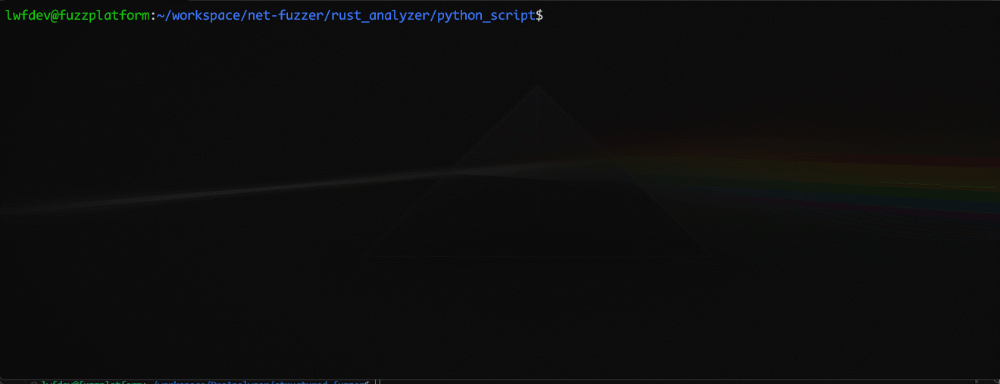
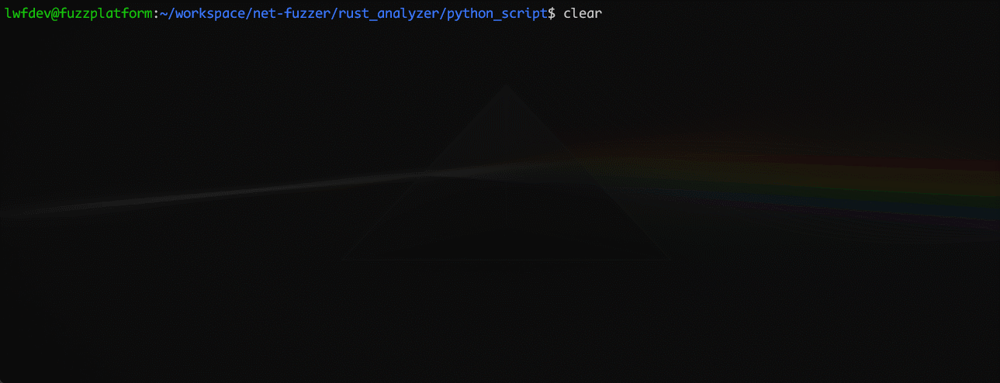

# ProAnalyzer (DEMO) 
​**​⚠️ Repository Notice​**​  
This repository contains ​**​core compilation code only​**​ for ProAnalyzer.  
To build fuzzing-instrumented targets, obtain QEMU-NYX tools from [NYX-NET Project](https://github.com/nyx-net/NYX-NET).

